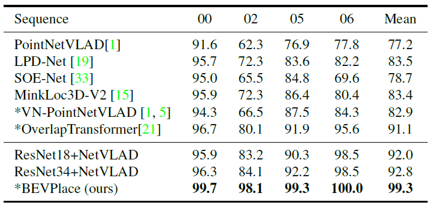
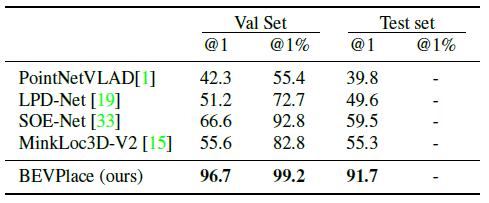
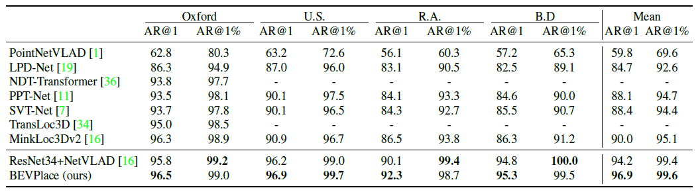
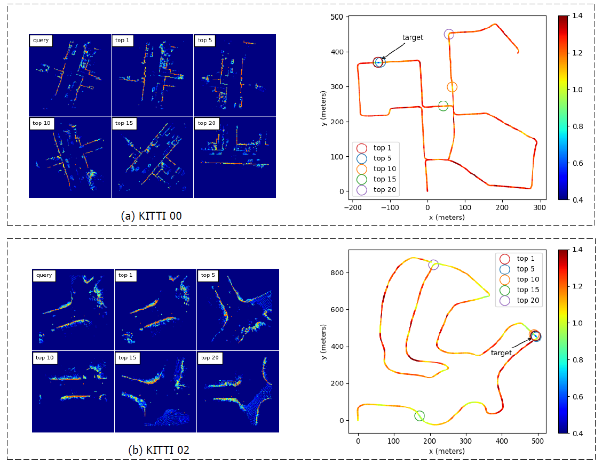

# BEVPlace++: Fast, Robust, and Lightweight LiDAR Global Localization for Unmanned Ground Vehicles
BEVPlace++ is a LiDAR-based global localization method. It projects point clouds into Bird's-eye View (BEV) images and generates global features with a rotation equivariant module and the NetVLAD. It sequentially performs place recognition and pose estimation to achieve complete global localization. Experiments show that BEVPlace++ significantly outperforms the state-of-the-art (SOTA) methods and generalizes well to previously unseen environments. BEVPlace++ will certainly benefit various applications, including loop closure detection, global localization, and SLAM. Please feel free to use and enjoy it!

> More details can be found in our pre-print paper https://arxiv.org/pdf/2408.01841.

# Results

> Loop results on KITTI 08.
<video src="https://github.com/user-attachments/assets/a61b4d84-a220-40b9-add1-8473a05f46c5)
https://github.com/user-attachments/assets/a61b4d84-a220-40b9-add1-8473a05f46c5"></video>


> Global localization demo on NCLT.
<video src=https://github.com/user-attachments/assets/042a923e-1bde-47f1-822a-86e92b21c15d></video>


# Quick Start

1. Download the dataset from [google drive](https://drive.google.com/file/d/1-oNthUKg4ysrbZ_sEjiylON9w93KCUT5/view?usp=drive_link). Unzip and move the files into the "data" directory.

2. Create a conda environment and install Pytorch according to your Cuda version. Then install the dependencies by 
```
pip install -r requirements.txt
```

3. You can train and evaluate BEVPlace++ by simply running
```
python main.py --mode=train
python main.py --mode=test --load_from=/path/to/your/checkpoint/directory
```


# Evaluate your own data
Organize your own data following the description in [data.md](./data/data.md) and custom you dataloader following kitti_dataset.py. Then evaluate the performance with the script main.py

<!-- # Results
Here are some experimental results on large-scale datasets.
### Recall rates on KITTI

### Recall rates on ALITA

### Recall rates on the benchmark dataset


### Some samples on KITTI
 -->

# News
- 2024-08-04: BEVPlace++ is released. Compared to BEVPlace, it achieves complete 3DoF global localization.
- 2023-08-31: Update the pre-trained weights and the bev dataset of KITTI to reproduce the numbers in the paper. 
- 2023-07-14: Our paper is accepted by ICCV 2023!
- 2023-03-14: Initial version
- 2022-09-02: Our method ranked 2nd in the General Place Recognition Competition of ICRA 2022! (The 1st place solution is based on ensemble learning)

# Cite
```
@INPROCEEDINGS{luo2023bevplace,
  author={Luo, Lun and Zheng, Shuhang and Li, Yixuan and Fan, Yongzhi and Yu, Beinan and Cao, Si-Yuan and Li, Junwei and Shen, Hui-Liang},
  booktitle={2023 IEEE/CVF International Conference on Computer Vision (ICCV)}, 
  title={BEVPlace: Learning LiDAR-based Place Recognition using Bird’s Eye View Images}, 
  year={2023},
  pages={8666-8675},
  doi={10.1109/ICCV51070.2023.00799}}
```
